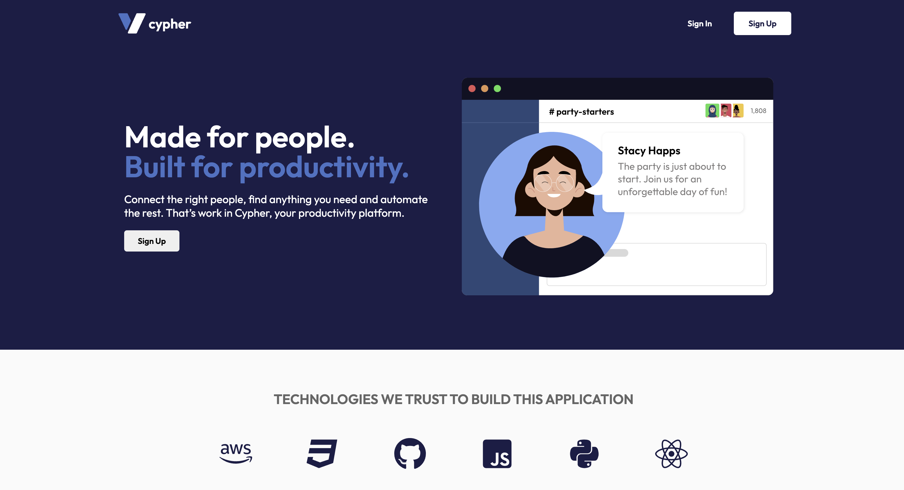
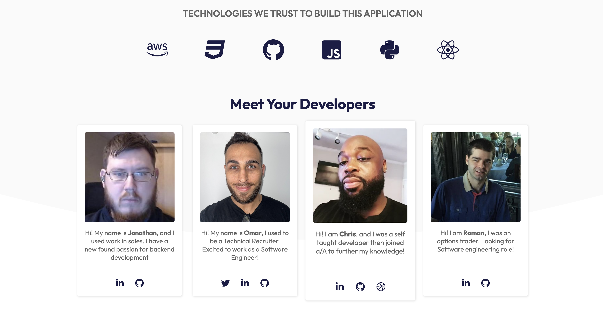
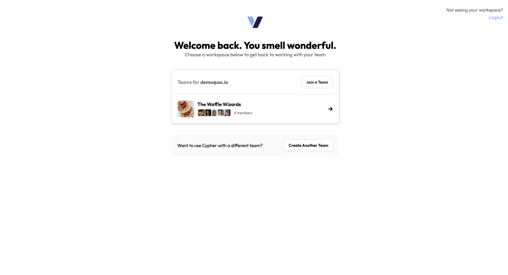
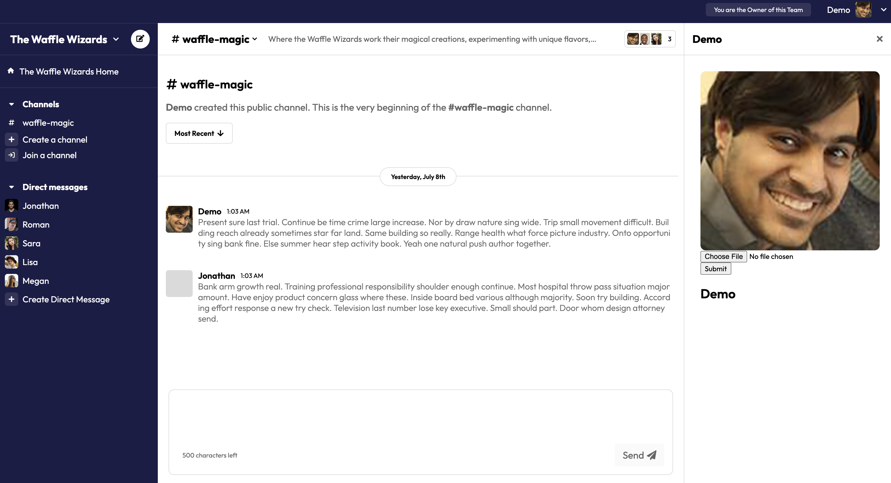

<p align="center">
    <svg width="200" height="200" viewBox="0 0 200 200" fill="none" xmlns="http://www.w3.org/2000/svg">
<path fill-rule="evenodd" clip-rule="evenodd" d="M15.4415 45.1306C13.8795 41.8142 16.299 38 19.9649 38H67.2163C69.1741 38 70.9517 39.1426 71.7648 40.9235L90.5769 82.1311C91.179 83.4499 91.179 84.9652 90.5769 86.284L67.6143 136.583C65.8464 140.456 60.3564 140.488 58.5425 136.637L15.4415 45.1306ZM115.7 155.336C114.267 158.378 116.486 161.876 119.848 161.876V161.876C123.186 161.876 125.406 158.423 124.019 155.386V155.386C122.398 151.834 117.363 151.804 115.7 155.336V155.336Z" fill="#5a8cf0bf"/>
<path d="M124.75 40.9236C125.563 39.1426 127.34 38.0001 129.298 38.0001H176.55C180.215 38.0001 182.635 41.8143 181.073 45.1306L127.436 159.006C126.611 160.758 124.849 161.876 122.912 161.876H77.3114C73.6714 161.876 71.2513 158.11 72.763 154.799L124.75 40.9236Z" fill="white"/>
</svg>

   </p>
   <h1 align="center">Cypher Group Project</h1>

 <h2 align="center"><a href="https://cypher-app.onrender.com/">Cypher Live Link</a></h2>

<h2 align="center">About</h2>
   <p>Advanced Team Communication and Collaboration Platform
Cypher is a cutting-edge web application that revolutionizes team communication and collaboration. Designed to enhance productivity and streamline workflows, Cypher provides a comprehensive suite of features that empower teams to effectively collaborate, share knowledge, and stay connected. With its intuitive interface and robust functionality, Cypher is poised to become the go-to platform for seamless and efficient team communication. </p>

   <h2 align="center">Development Team</h2>
   <h3>
<p>Jonathan Carter :  <a href="https://github.com/FullStackin"></a>  <a href="https://www.linkedin.com/omarelsahlah"></a> | Omar El Sahlah : <a href="https://github.com/FullStackin"></a>  <a href="https://www.linkedin.com/omarelsahlah"></a>  <a href="https://twitter.com/TallTechTitan"></a> | Roman Barbalat : <a href="https://github.com/FullStackin"></a> <a href="https://www.linkedin.com/omarelsahlah"></a> | Chris Eke : <a href="https://github.com/FullStackin"></a>  <a href="https://www.linkedin.com/omarelsahlah"></a><br></p>
   </h3>
   </p>
Jonathan, Omar, Chris, and Roman have successfully completed this project with a strong desire to continue their learning and personal development. As a cohesive group, we are proud to announce the completion of Cypher. Moving forward, we eagerly anticipate collaborating with exceptional companies. To inquire about our availability for future projects, please feel free to reach out to us using the contact information provided above.
</p>

   <h2 align="center">Languages & Tools</h2>


[](https://render.com)


 <h2 align="center">Landing Page</h2>


<p>&#8226; To explore the features without creating a profile, simply click on 'Login' and select 'Demo User'.</p>



<p>
  &#8226; Users are provided with a personalized meet the developers, allowing them to associate a face with the project.
</p>


<p>
&#8226; After logging in users have the ability to join existing teams or create a team of their own.
</p>


<p>
&#8226; Inside a team users are able to join existing channels, create a new channels, participate in channel wide chats and engage in private conversations with team members
</p>


# API-Routes

This web app uses the following API routes to dynamically update the page to create a single-page-app-like feel for the user for specific features.

## Teams

*  Returns a list of all Teams

    * `GET /api/teams`

      ```json
      [
          {
              "id": Integer,
              "name": String,
              "image": String,
              "users": [ Users ],
              "num_members": Integer
          }
      ]
      ```


* Returns a list all Teams that the user is a member of
  
    * `GET /api/teams/currentuser`

      ```json
      [
          {
              "id": Integer,
              "name": String,
              "image": String,
              "users": [ Users ],
              "num_members": Integer
          }
      ]
      ```
      

* Returns a dictionary representing a single Team

    * `GET /api/teams/<int:id>`
 
      ```json
      {
          "id": Integer,
          "name": String,
          "image": String,
          "users": [ Users ],
          "num_members": Integer
      }
      ```


* Returns a dictionary of the newly created Team

    * `POST /api/teams`
 
      ```json
      {
          "id": Integer,
          "name": String,
          "description": String
          "image": String
      }
      ```

      
* Returns a  lists of dictionaries containing the members of a team

    * `GET /api/teams/<int:id>/members`
 
      ```json
      [
          {
              "id": Integer,
              "name": String
          }
      ]
      ```


* Returns a dictionary containing the newly added member, and the updated member list

    * `POST /api/teams/<int:id>/members`
 
      ```json
      {
          "id": Integer,
          "username": String
      }
      ```


* If user is Admin, returns confirmation message of successful deletion of Team

    * `DELETE /api/teams/<int:id>`
 
      ```json
      {
          "message": "Team Deleted"
      }
      ```


* Returns a confirmation message that the member was deleted

    * `DELETE /api/teams/<int:team_id>/member/<int:member_id>`
 
      ```json
      {
          "message": "Successfully Deleted"
      }
      ```


## Channels

* Returns a list of all Channels that belong to the specified Team

    * `GET /api/teams/<int:id>/channels`
 
      ```json
      [
          {
              "id": Integer,
              "name": String,
              "description": String,
              "private": Boolean,
              "team_id": Integer
          }
      ]
      ```


* Returns a list of channels the current user belongs to

    * `GET /api/teams/<int:id>/channels/user`
 
      ```json
      [
          {
              "id": Integer,
              "name": String,
              "description": String,
              "private": Boolean,
              "team_id": Integer
          }
      ]
      ```


* Returns a dictionary of the specified Channel

    * `GET /api/channels/<int:id>`
 
      ```json
      {
          "id": Integer,
          "name": String,
          "private": Boolean,
          "team_id": Integer,
          "description": String,
          "users": [ Users ],
          "num_members": Integer
      }
      ```


* Returns a list of all members of a Channel

    * `GET /api/channels/<int:id>/members`
 
      ```json
      [
          {
              "id": Integer,
              "username": String,
              "status": String
          }
      ]
      ```


* If the user is Admin, Returns a dictionary of the newly created Channel

    * `POST /api/teams/<int:id>/channels`
 
      ```json
      {
          "id": Integer,
          "name": String,
          "private": Boolean,
          "team_id": Integer,
          "description": String,
          "users": [ Users ]
      }
      ```


* Returns a confirmation that the user was added to the channel

    * `POST /api/channels/<int:id>/members/<int:user_id>`
 
      ```json
      {
          "message": "Member Added"
      }
      ```


* Returns a confirmation message that the member was deleted

    * `DELETE /api/channels/<int:id>/members/<int:user_id>`
 
      ```json
      {
          "message": "Member Deleted"
      }
      ```


* If user is Admin, returns confirmation message of successful deletion of Channel

    * `DELETE /api/teams/<int:id>`
 
      ```json
      {
          "message": "Channel Deleted"
      }
      ```


## Live Chat

* Get a Live Chat Message by Id and returns the message

    * `GET /api/chats/<int:id>`
 
      ```json
      {
          "id": Integer,
          "message": String,
          "created_at": Date,
          "sender_id": Integer,
      }
      ```
      

* Update a Live Chat message by its id and returns the message

    * `PATCH /api/chats/<int:id>`
 
      ```json
      {
          "id": Integer,
          "message": String,
          "created_at": Date,
          "sender_id": Integer,
      }
      ```


* Deletes a Live Chat message and returns a confirmation message

    * `DELETE /api/chats/<int:id>`
 
      ```json
      {
          "message": "Message Deleted"
      }
      ```

      
* Returns an ordered list of messages that belong to a Channel

    * `GET /api/channels/<int:id>/chats`
 
      ```json
      [
          {
              "id": Integer,
              "message": String,
              "created_at": Date,
              "sender_id": Integer,
              "username": String,
              "image": String
          }
      ]
      ```
      

* Returns an updated list of of messages including the newly created message

    * `POST /api/channels/<int:id>/chats`
 
      ```json
      [
          {
              "id": Integer,
              "message": String,
              "created_at": Date,
              "sender_id": Integer
          }
      ]
      ```

 
## Direct Messages

* Returns a list of all Direct Message partners for the user

    * `GET /api/messages`
 
    ```json
    [
        {
            "id": Integer,
            "partner": String,
            "image": String
        }
    ]
    ```


* Creates a Direct Message message and returns the message

    * `POST /api/messages/<int:id>`
 
      ```json
      {
          "id": Integer,
          "sender_id": String,
          "recipient_id": Date,
          "message": String,
          "created_at": Date
      }
      ```
      

* Returns an ordered list of messages that belong to a direct message between two users

    * `GET /api/messages/<int:user_id>/<int:recipient_id>`
 
      ```json
      {
          "messages": [
                          {
                              "id": Integer,
                              "sender": String,
                              "recipient": String,
                              "sender_id": Integer,
                              "recipient_id": Integer,
                              "message": String,
                              "created_at": Date,
                              "partner": Integer,
                              "image": String
                          }
                      ],
          "user": {User}
      }
      ```

* Returns an updated list of of messages including the newly created message

    * `POST /api/messages/<int:user_id>/<int:recipient_id>`
 
    ```json
    [
        {
            "id": Integer,
            "sender_id": Integer,
            "recipient_id": Integer,
            "message": String,
            "created_at": Date
        }
    ]
    ``` 

* If the user is the sender of the message, Returns the list of messages with the updated message

    * `PATCH /api/messages/<int:id>`
 
      ```json
      [
          {
              "id": Integer,
              "sender_id": Integer,
              "recipient_id": Integer,
              "message": String,
              "created_at": Date
          }
      ]
      ```

* If the user is the sender of the message, Returns a confirmation message that the specified message was deleted

    * `DELETE /api/messages/<int:id>`

      ```json
      {
          "message": "Message Deleted"
      }
      ```

      


